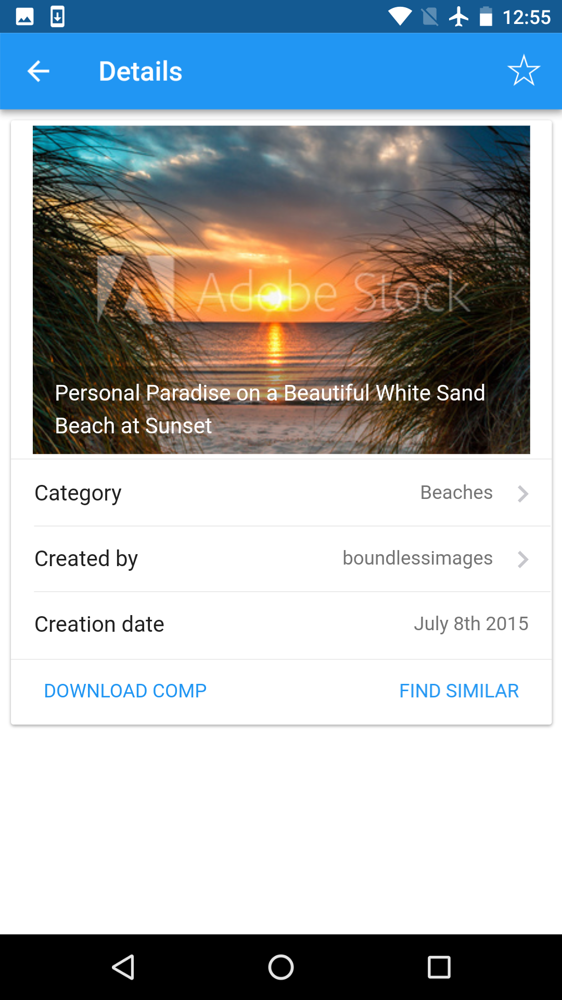
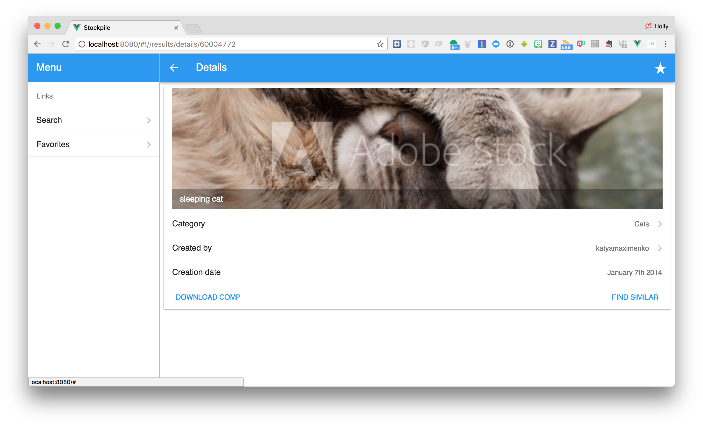
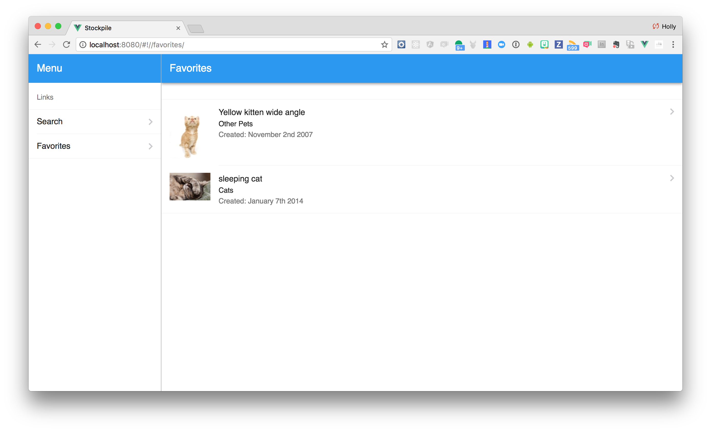
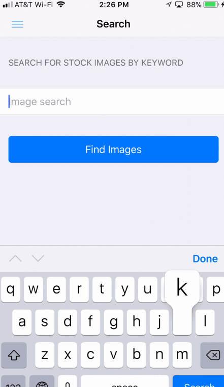

# Lesson 10 - Add Favorites to Details

Now that there's an API available for favoriting items, you need to add some way to use it in the user interface so images can be favorited. A good place to do this is in the **Details** view.

In this lesson you will add a star icon to the navigation bar in the Details view that will be used to display and toggle the item's favorited status.

## Implement the UI

1. Open the `Details.vue` file
1. Replace the current `<f7-navbar.../>` block with the following snippet which now includes an empty or filled star icon to indicate if this image is a favorite or not (filled=favorite, empty=not), based on an `isFavorite` property you will add shortly. This new icon also has a click handler set on it which needs to call a function to toggle its status. You may notice it also specifies a dynamic `back-link` property bound to a computed property `backLink` you will code below:

    ```html
      <f7-navbar :back-link="backLink" sliding>
        <f7-nav-center>
          Details
        </f7-nav-center>
        <f7-nav-right>
          <f7-link icon-f7="star_filled" @click="toggleFavorite"
            v-if="isFavorite"
          />
          <f7-link icon-f7="star" @click="toggleFavorite" v-else />
        </f7-nav-right>
      </f7-navbar>
    ```

    You should now have a star icon displayed on your navbar like in the image below:

  

## Add JavaScript Handling

There are some additional changes to make to the JavaScript to enable the favorites handling.

1. In the computed properties block, add a new property called `displayingFavorite` to indicate if this item was selected off the favorites view or not. This code checks the route URL for the existence of a `displayingFavorite` parameter to determine if this view was a result of selecting an item in the favorites list or not.

    ```javascript
      displayingFavorite () {
        const { displayingFavorite = false } = this.$route.query;
        return !!displayingFavorite;
      }
    ```

    > In the Favorites view lesson you added a method `clickItem`, which defined a `displayingFavorite=true` parameter in the path when the details page is loaded, to indicate when the view was shown from Favorites specifically.

1. Define a new computed property for for `backLink`, which uses the `displayingFavorite` property defined above  to determine where to go back to (either the **Favorites** list or **Results** list):

    ```javascript
      backLink () {
        if (this.displayingFavorite) {
          return 'Favorites';
        } else {
          return 'Results';
        }
      }
    ```

1. Add a computed property to check if an item is already a favorite by comparing id's to those in the existing `favorites` array:

    ```javascript
      isFavorite () {
        const filteredFavorites =
          this.favorites.filter(favorite => favorite.id.toString() === this.id);
        return !!filteredFavorites.length;
      }
    ```

1. Update (or just replace) the `item` computed property with the following, to support an item being selected from the favorites view as well:

    ```javascript
      item () {
        // Fallback default for when images* and favorites* are reset in
        //  the store
        if (this.displayingFavorite) {
          if (this.favoritesById && this.favoritesById[this.id]) {
            this.stockItem = Object.assign(
              {},
              this.stockItem,
              this.favoritesById[this.id]);
          }
          return this.stockItem;
        }
        if (this.imagesById && this.imagesById[this.id]) {
          this.stockItem = Object.assign(
            {},
            this.stockItem,
            this.imagesById[this.id]);
        }
        return this.stockItem;
      },
    ```

1. Add an import for the `toggleFavorite` function created previously in the `favorites.js` file, just under the import for `moment.js`:

    ```javascript
      import { toggleFavorite } from '../../utils/favorites';
    ```

1. Next, in your `methods` object, add the following `toggleFavorite()` method:

    ```javascript

      toggleFavorite () {
        const { mainView: { router } } = this.$f7;
        if (this.displayingFavorite) {
          // let the animation happen before removing the fave
          setTimeout(() => {
            toggleFavorite(this.item);
          }, 410);
          router.back();
        } else {
          toggleFavorite(this.item);
        }
      }
    ```

    This code runs when the star icon is clicked to toggle the *favorite* status of the item. It will take a different course based on whether it was displayed as a result of a click on a Favorited list item or not:

    - If it was shown from the favorites list, it was already favorited, so clicking the star is essentially *unfavoriting* it, and as a result the item will be removed from the favorites array (via the API call to `toggleFavorite`). At this time the view is also reset (via `router.back()`).
    - If it was shown from the regular results list, the `toggleFavorite` function is called directly and the view does not need to reset (since the user could still *unfavorite* it again).

    

    > Note that there are two `toggleFavorite` methods used above, an instance `toggleFavorite` method and the `toggleFavorite` method imported from the API defined in **`favorite.js`**. The instance method simply calls the API method of the same name.

## Run it!

1. Begin by doing a search and favoriting an item using the star icon.
1. Ensure the icon toggles to a filled in star:

    

1. Then use the side menu to navigate to your Favorites page and ensure you see your item added:

    

    
